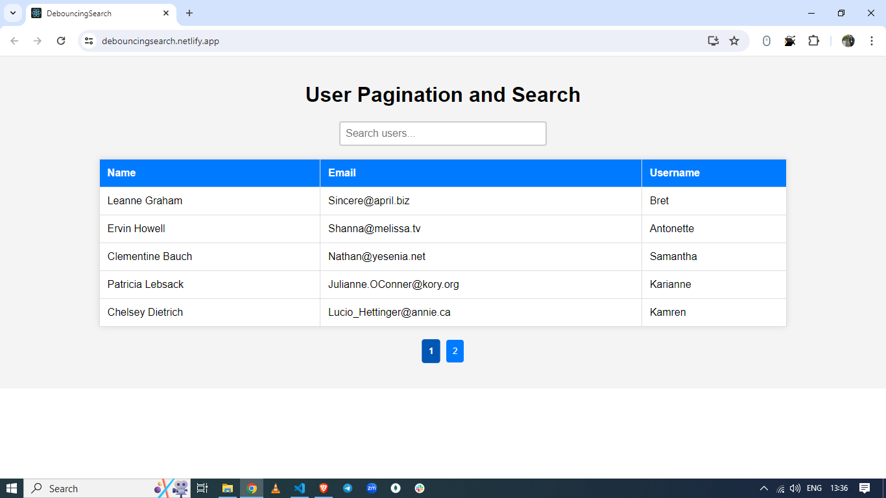

# User Pagination and Search

This project is a React-based application that implements user pagination, debouncing for search input, and displays content in a table format. The application fetches data from an external API and allows users to search and filter the data with a smooth and responsive user interface.

## Live Demo

You can view the live demo of this project [here](https://debouncingsearch.netlify.app/).

## Features

- **Pagination**: Efficiently navigates through a large dataset by dividing it into pages.
- **Debouncing**: Prevents excessive API calls by delaying the search function execution until the user has stopped typing for a specified period.
- **Responsive UI**: Displays user data in a table format with alternating row colors and hover effects for better readability.
- **Search Functionality**: Filters user data based on the search term input by the user.

## Screenshot



## Installation

To run this project locally, follow these steps:

1. Clone the repository:
   ```bash
   git clone https://github.com/your-username/user-pagination-search.git
   cd user-pagination-search
